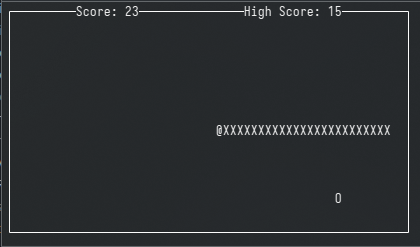

# Snake in C

Snake written in C.

Uses ncurses for TUI.

## Building

Building has only been tested on Linux 64-bit.

Will build the `snake` executable.

* Use `make` to build
* Use `make run` to build and run
* Use `make clean` to clean object files and executable

Building and running will require the `ncurses` library
